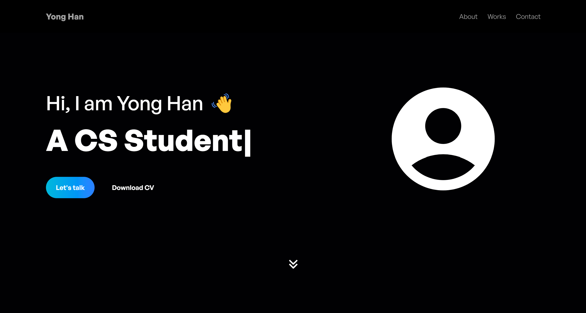

# 🚀 Yong Han's Portfolio Website

A modern, interactive portfolio website showcasing my journey as a Computer Science student and developer. Built with React, Tailwind CSS, and Framer Motion for smooth animations and engaging user experience.



## ✨ Features

### 🎨 **Modern Design**
- Clean, responsive design with dark theme
- Mobile-first approach ensuring perfect display on all devices
- Smooth animations and micro-interactions using Framer Motion

### 🎬 **Interactive Project Showcase**
- **Video Previews**: Hover over project cards to see live video demos
- **Smart Fallback**: Automatic webm/mp4 format selection for optimal compatibility
- **Detailed Project Cards**: Complete with tech stack tags and live/source links

### 🛠️ **Draggable Tech Stack**
- Interactive, draggable technology grid
- Hover effects with icon animations
- Visual stats showcase (Years of Learning, Technologies, Projects)

### 🎯 **Dynamic Content**
- **Typing Animation**: Rotating professional titles in hero section
- **Smooth Scrolling**: Seamless navigation between sections
- **Scroll-triggered Animations**: Content appears as you scroll

### 📱 **Responsive Navigation**
- Sticky navigation with backdrop blur effect
- Mobile hamburger menu with smooth animations
- Smart scroll-to-section functionality

## 🛠️ Tech Stack

### **Frontend Framework**
- **React 19** - Latest React with modern features
- **Vite** - Fast build tool and development server

### **Styling & Animation**
- **Tailwind CSS 4** - Utility-first CSS framework
- **Framer Motion 12** - Production-ready motion library

### **Icons & UI**
- **React Icons 5** - Comprehensive icon library
- **React Type Animation** - Smooth typing effects

### **Development Tools**
- **ESLint 9** - Code linting and quality
- **Vite Plugin MkCert** - HTTPS development support

## 🚀 Quick Start

### Prerequisites
- Node.js (v18 or higher)
- npm or yarn package manager

### Installation

1. **Clone the repository**
   ```bash
   git clone https://github.com/yonghan18/portfolio.git
   cd portfolio
   ```

2. **Install dependencies**
   ```bash
   npm install
   ```

3. **Start development server**
   ```bash
   npm run dev
   ```

4. **Open your browser**
   ```
   http://localhost:5173
   ```

### Available Scripts

| Command | Description |
|---------|-------------|
| `npm run dev` | Start development server |
| `npm run build` | Build for production |
| `npm run preview` | Preview production build |
| `npm run lint` | Run ESLint code analysis |
| `npm start` | Start with HTTPS (requires certificates) |

## 📁 Project Structure

```
portfolio/
├── public/                 # Static assets
│   └── assets/            # Images, videos, icons
│       ├── *.png          # Project screenshots
│       ├── *.webm         # Video previews (optimized)
│       ├── *.mp4          # Video previews (fallback)
│       └── *.svg          # Icons and graphics
├── src/                   # Source code
│   ├── components/        # React components
│   │   ├── NavBar.jsx     # Navigation with mobile menu
│   │   ├── Hero.jsx       # Landing section with animations
│   │   ├── About.jsx      # About me + draggable tech stack
│   │   ├── Work.jsx       # Projects showcase with videos
│   │   ├── Achievements.jsx # Accomplishments section
│   │   └── Contact.jsx    # Contact info and footer
│   ├── constants/         # Data and configuration
│   │   └── index.js       # Project data, nav links, achievements
│   ├── App.jsx           # Main app component
│   ├── main.jsx          # React app entry point
│   └── index.css         # Global styles and Tailwind imports
├── index.html            # HTML template
├── vite.config.js        # Vite configuration
├── tailwind.config.js    # Tailwind CSS configuration
└── package.json          # Dependencies and scripts
```

## 🎯 Key Components

### **NavBar Component**
- Responsive navigation with smooth scroll
- Mobile hamburger menu with animations
- Logo click scrolls to top

### **Hero Section**
- Dynamic typing animation with rotating titles
- Floating background elements
- Interactive scroll-down arrow

### **About Section**
- Draggable tech stack grid (4 visible, scroll for more)
- Animated statistics cards
- Personal introduction text

### **Work Section**
- Project cards with hover video previews
- Automatic webm/mp4 format selection
- Technology tags with hover effects
- Live site and source code links

### **Achievements Section**
- Grid layout of accomplishments
- Categorized by type (Academic, Competition, etc.)
- Animated card reveals

### **Contact Section**
- Social media links with hover animations
- Professional footer with copyright

## 🎨 Design Features

### **Animation System**
- **Scroll-triggered**: Content animates in as it becomes visible
- **Staggered animations**: Child elements appear in sequence
- **Hover effects**: Interactive feedback on all clickable elements
- **Mobile optimized**: Animations scale appropriately for touch devices

### **Performance Optimizations**
- **Lazy loading**: Videos only load on hover
- **Format selection**: Browser chooses optimal video format
- **Efficient rendering**: useInView hook prevents unnecessary animations
- **Smooth scrolling**: Hardware-accelerated transitions

## 🔧 Customization

### **Adding New Projects**
Edit `src/constants/index.js` and add to the `projects` array:

```javascript
{
  id: 6,
  title: "Your Project Name",
  description: "Project description...",
  image: "/assets/project-image.png",
  video_webm: "/assets/project-video.webm", // Optional
  video_mp4: "/assets/project-video.mp4",   // Optional
  technologies: ["React", "Node.js", "MongoDB"],
  liveUrl: "https://your-project.com",
  sourceUrl: "https://github.com/your-repo"
}
```

### **Updating Tech Stack**
Modify the `techStack` array in `src/About.jsx`:

```javascript
{ name: "Technology Name", icon: IconComponent, color: "text-color-class" }
```

### **Adding Achievements**
Update the `achievements` array in `src/constants/index.js`:

```javascript
{
  id: 7,
  title: "Achievement Title",
  organization: "Organization Name",
  date: "2024",
  description: "Achievement description...",
  category: "Category"
}
```

## 🌟 Highlights

- **Modern React 19** with latest features and performance improvements
- **Smooth animations** that enhance user experience without overwhelming
- **Video previews** provide immediate project understanding
- **Responsive design** works perfectly on desktop, tablet, and mobile
- **Performance focused** with optimized loading and rendering
- **Accessible** with proper ARIA labels and semantic HTML

## 📄 License

This project is open source and available under the [MIT License](LICENSE).

## 🤝 Connect

- **GitHub**: [github.com/yonghan18](https://github.com/yonghan18)
- **LinkedIn**: [linkedin.com/in/yonghan](https://linkedin.com/in/yonghan)
- **Email**: yonghan@example.com

---

Built with ❤️ by Yong Han using React, Tailwind CSS, and Framer Motion.
