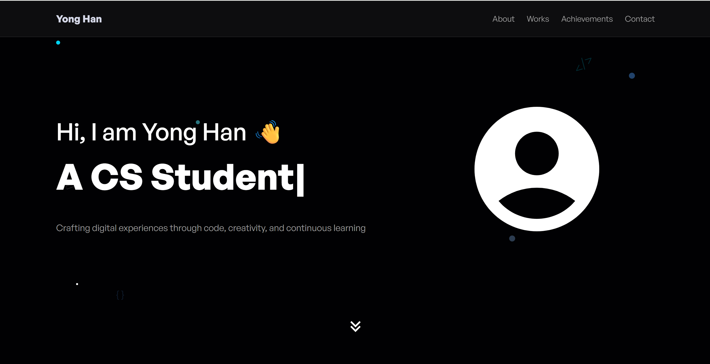

# 🚀 Yong Han's Portfolio Website

A modern, interactive portfolio website showcasing my journey as a Computer Science student and developer. Built with React, Tailwind CSS, and Framer Motion for smooth animations and engaging user experience.



## ✨ Features

### 🎨 **Modern Design**
- Clean, responsive design with dark theme
- Mobile-first approach ensuring perfect display on all devices
- Smooth animations and micro-interactions using Framer Motion


## 🛠️ Tech Stack

### **Frontend Framework**
- **React 19** - Latest React with modern features
- **Vite** - Fast build tool and development server

### **Styling & Animation**
- **Tailwind CSS 4** - Utility-first CSS framework
- **Framer Motion 12** - Production-ready motion library

### **Icons & UI**
- **React Icons 5** - Comprehensive icon library
- **React Type Animation** - Smooth typing effects

### **Development Tools**
- **ESLint 9** - Code linting and quality
- **Vite Plugin MkCert** - HTTPS development support

## 🚀 Quick Start

### Prerequisites
- Node.js (v18 or higher)
- npm or yarn package manager

### Installation

1. **Clone the repository**
   ```bash
   git clone https://github.com/yonghan18/portfolio.git
   cd portfolio
   ```

2. **Install dependencies**
   ```bash
   npm install
   ```

3. **Start development server**
   ```bash
   npm run dev
   ```

4. **Open your browser**
   ```
   http://localhost:5173
   ```

### Available Scripts

| Command | Description |
|---------|-------------|
| `npm run dev` | Start development server |
| `npm run build` | Build for production |
| `npm run preview` | Preview production build |
| `npm run lint` | Run ESLint code analysis |


